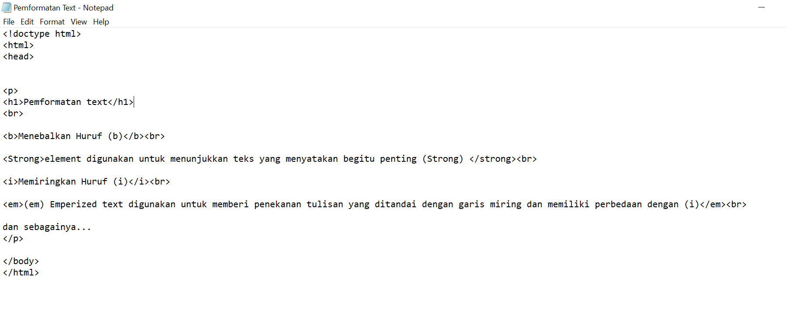
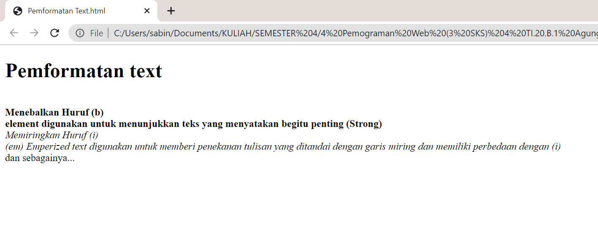
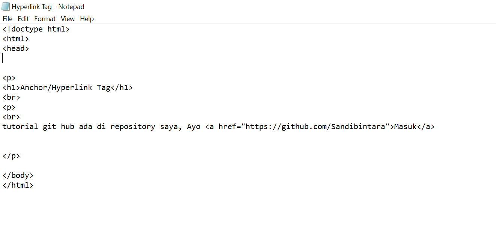
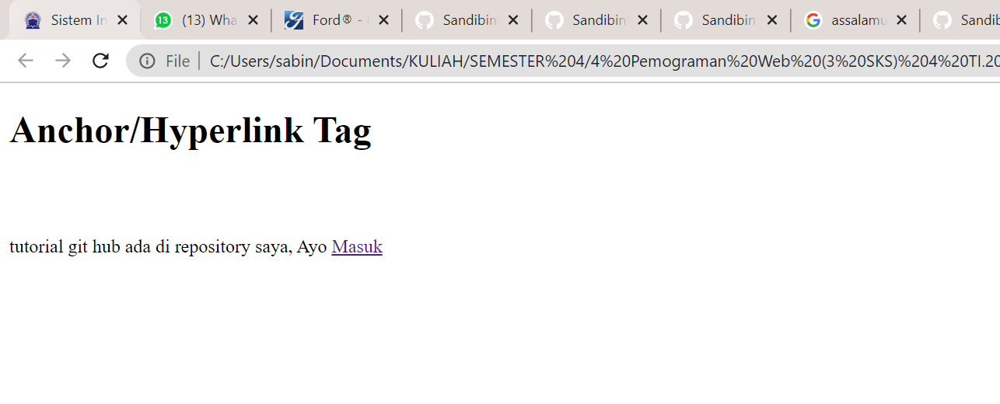
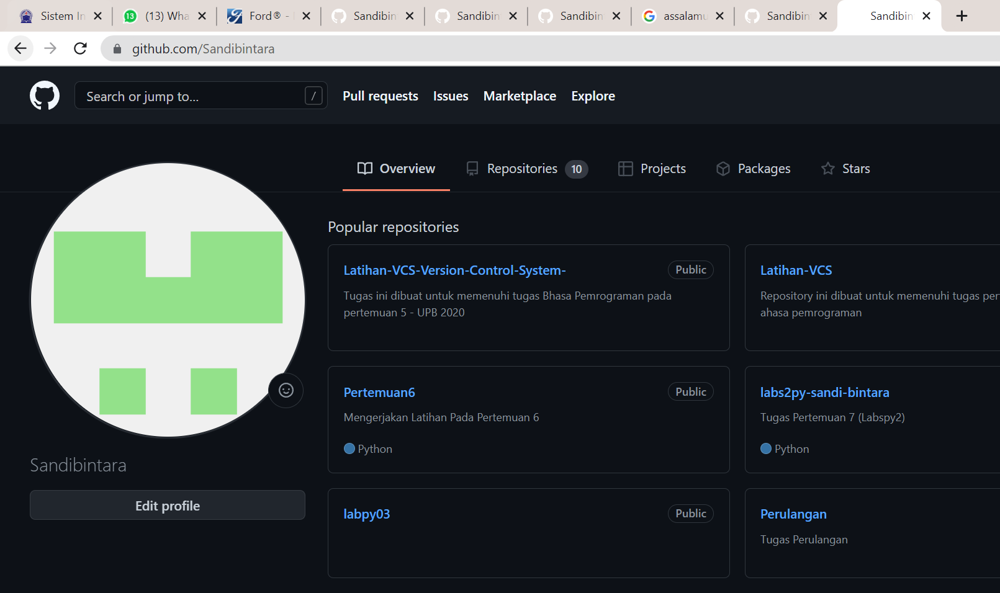

# Lab1Web

<h1>السلام عليكم ورحمة الله وبركاته
 
---------------------------------------------------------------
<h2> Repository ini di buat untuk memenuhi pembelajaran HTML pada semester 4
 
----------------------------------------------------------------------------

1. Pengertian HTML	[meluncur](#Pengertian-HTML)
2. Struktur HTML	[meluncur](#Struktur-HTML)
3. Pemformatan Text	[meluncur](#Pemformatan-Tag)
4. Anchor/Hyprlink tag	[meluncur](#Hyperlink-Tag)
 
 

---
## Pengertian HTML
---
 

> Sebuah bahasa markup yang digunakan untuk membuat
sebuah halaman web dan menampilkan berbagai informasi di
dalam sebuah browser

 
 

---
## Struktur HTML
---
 

> Rangkaian HTML
---

 
``gambar di atas merupakan rangkaian html yang berisi Document Information (<!doctype html>),Document Header(<head></head>),Document Body (<body></body>), elment. Pengetikan tag dengan (berikut dengan tag pembuka (<tag>), tag penutup (</tag>), single tag (
, ,dsb), tag Heading (<h1><h2>sd<h10..>)``
 

> Output dari rangkaian HTML tersebut
---

 
---

## Pemformatan Tag
---
 

> Syntax HTML Pemformatan Tag
---

 

> Output Syntax Pemformatan Tag
---

 

---
## Hyperlink Tag
---
 

> Syntax Hyperlink Tag
---

 

> Output Hyperlink Tag
---
 

output 1

 

output 2

 

<h1> Hallo Guys
 
<h2> Hallo lia

