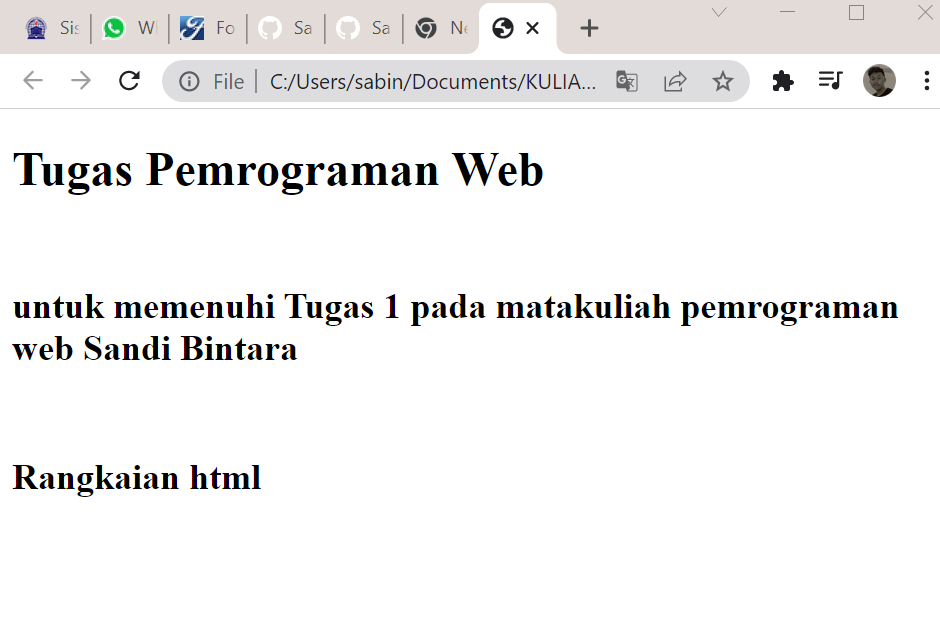

# Lab1Web

<h1>السلام عليكم ورحمة الله وبركاته
<br>
---------------------------------------------------------------
<h2> Repository ini di buat untuk memenuhi pembelajaran HTML pada semester 4
<br>
----------------------------------------------------------------------------
<br>
1. Pengertian HTML	[meluncur](##Pengertian-HTML)<br>

2. Struktur HTML	[meluncur](##Struktur-HTML)
<br>

## Pengertian HTML
---
<br>

> Sebuah bahasa markup yang digunakan untuk membuat
sebuah halaman web dan menampilkan berbagai informasi di
dalam sebuah browser
<hr>
<br>

## Struktur HTML
---
<br>

### Rangkaian HTML
---

<br>
> ```gambar di atas merupakan rangkaian html yang berisi Header, Body, single tag (<hr>,<br>,dsb),tag heading, berikut dengan tag pembuka (<tag>) serta penutupnya (</tag>)```
<br>

### Output dari rangkaian HTML tersebut
---

<br>
<br>


