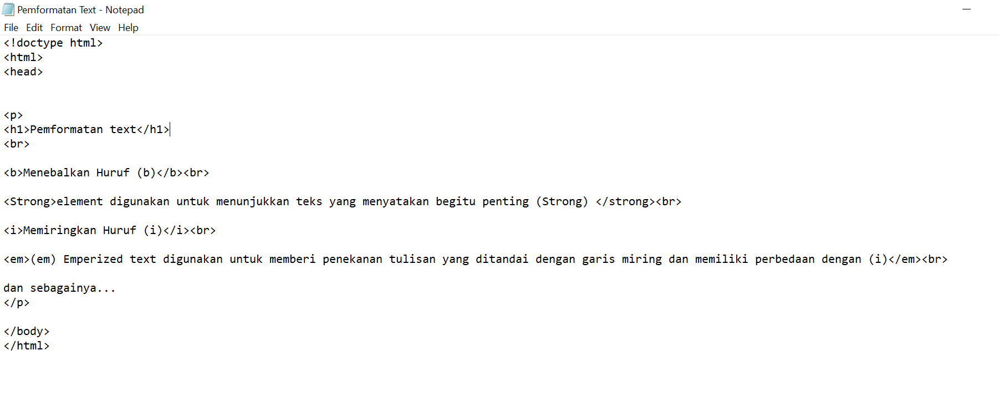
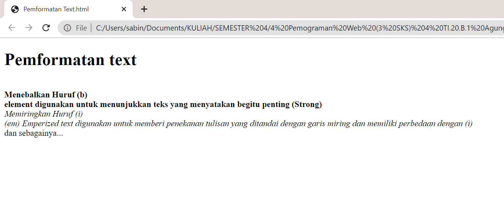

# Lab1Web

<h1>السلام عليكم ورحمة الله وبركاته
 
---------------------------------------------------------------
<h2> Repository ini di buat untuk memenuhi pembelajaran HTML pada semester 4
 
----------------------------------------------------------------------------
 

1. Pengertian HTML	[meluncur](#Pengertian-HTML)
2. Struktur HTML	[meluncur](#Struktur-HTML)
3. Pemformatan Text	[melincur](#Pemformatan-Text)

 

## Pengertian HTML
---
 

> Sebuah bahasa markup yang digunakan untuk membuat
sebuah halaman web dan menampilkan berbagai informasi di
dalam sebuah browser

 

## Struktur HTML
---
 

### Rangkaian HTML
---

 
> ``gambar di atas merupakan rangkaian html yang berisi Document Information (<!doctype html>),Document Header(<head></head>),Document Body (<body></body>), elment. Pengetikan tag dengan (berikut dengan tag pembuka (<tag>), tag penutup (</tag>), single tag (
, ,dsb), tag Heading (<h1><h2>sd<h10..>)``
 

### Output dari rangkaian HTML tersebut
---

 

## Pemformatan Text
---
 

### Syntax HTML Pemformatan Text
---

 

### Output Syntax Pemformatan Text
---

 

